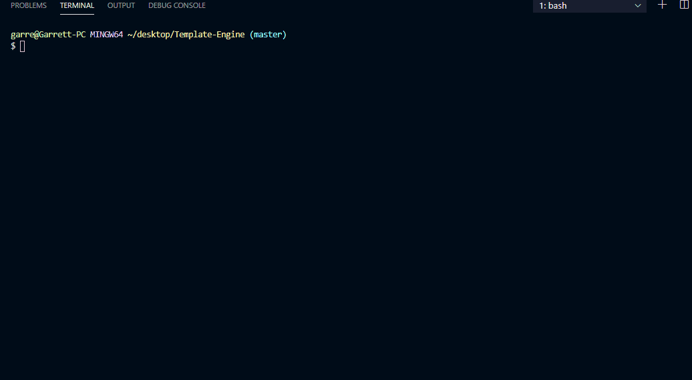

  

  

  
# **Project** 
Employee Template Engine

## Live Link 
* Insert Live Link Once Generated

##  **Table of Contents**
* Description
* Installation
* Technology Stack
* Usage

## **Description**
Generates a list of employees with status and contact information
## **Installation**
inquirer, jest
## **Technology Stack**
Node.Js, JavaScript, GitHub, Bootstrap, Command- Line
## **Usage**

## **Contributors**
Garrett Wells Griffey
## **Contact**
#### * Name: Garrett Wells Griffey
#### * GitHub: "https://github.com/garrettwgriffey" 
#### * Portfolio: "https://github.com/garrettwgriffey.github.io
#### * Email: [garrettwgriffey@gmail.com](garrettwgriffey@gmail.com)
#### * LinkedIn: https://www.linkedin.com/in/garrettwgriffey

## 

 

##### **License** 
* MIT
## Tests
###### To Run Tests, Run the Following Command: jest

